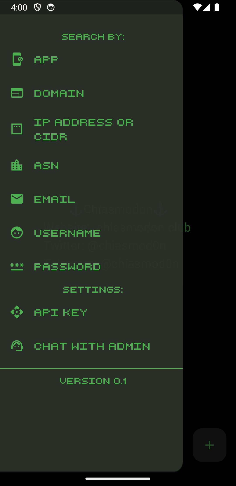
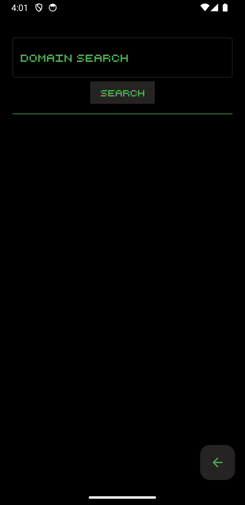

# Chiasmodon mobile

This repository contains the APK (Android Package) for Chiasmodon, an OSINT tool designed to assist in the process of gathering information about a target domain. The primary functionality of Chiasmodon revolves around searching for domain-related data, including domain emails, domain credentials, CIDRs, ASNs, subdomains, and allows users to search Google Play application IDs.

## 📱Usage

To install and run Chiasmodon mobile on an Android device, follow these steps:

1. Download the APK file from the [Releases](https://github.com/chiasmod0n/chiasmodon-mobile/releases) page.
2. Transfer the APK file to your Android device.
3. On your Android device, navigate to the location of the APK file using a file manager.
4. Tap on the APK file to initiate the installation process.
5. If prompted, allow installation from unknown sources in your device settings.
6. Follow the on-screen instructions to complete the installation.
7. Once installed, you can launch the Chiasmodon app from your device's app drawer.
8. Use the app's interface and features to perform domain-related information gathering.

## 📋Requirements

- Android device running Android 5.0 (Lollipop) or higher.

## 🔑 Subscription
Join us today and unlock the potential of our cutting-edge OSINT tool. Contact https://t.me/Chiasmod0n on Telegram to subscribe and start harnessing the power of Chiasmodon for your domain investigations.

## 🤝Contributing

If you'd like to contribute to Chiasmodon, please follow the guidelines in [CONTRIBUTING.md](CONTRIBUTING.md). Contributions are welcome and appreciated!

## 📄License

Chiasmodon mobile is licensed under the [MIT License](LICENSE).

## 🔗Chiasmodon Links

- [🐍 Python Library](https://pypi.org/project/chiasmodon)
- [💻  Script CLI](https://github.com/chiasmod0n/chiasmodon-mobile)
- [🌐 Website](https://chiasmodon.club)
- [💬 Telegram](https://t.me/chiasmod0n)
- [🐦 X/Twitter](https://x.com/chiasmod0n)

## Screenshots

